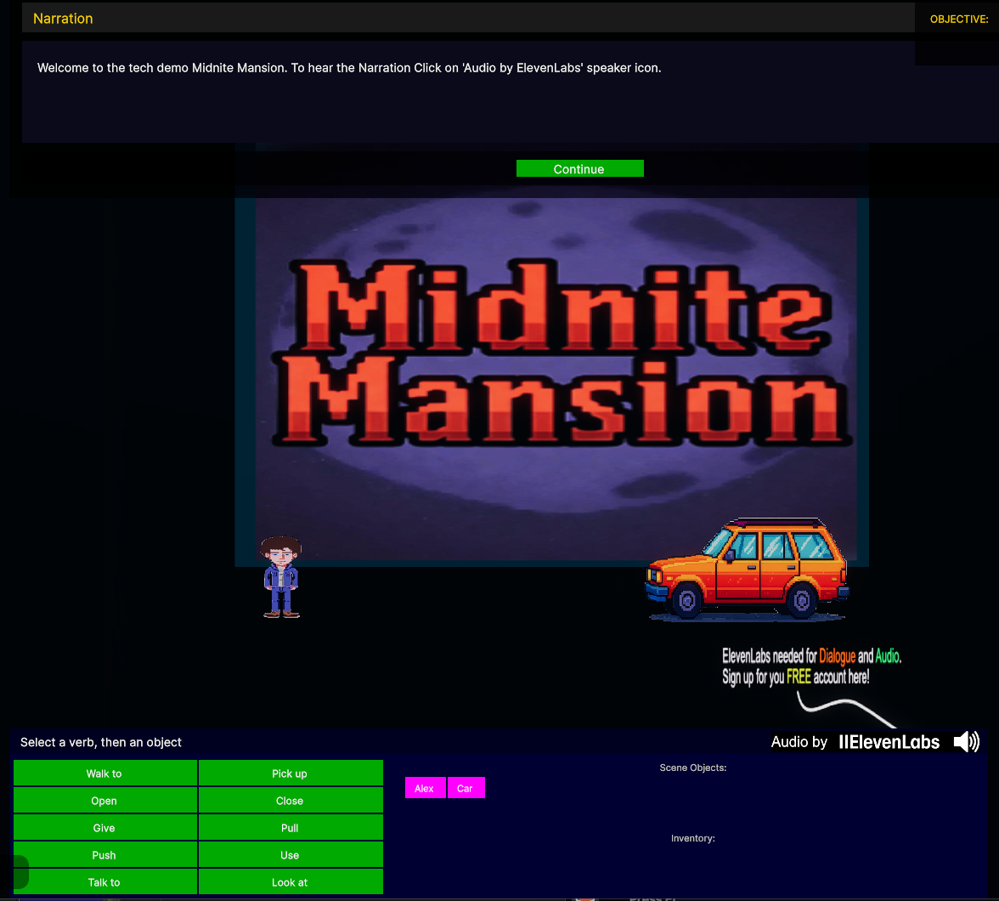

# Midnite Mansion

  

  

## About

**Midnite Mansion** is a classic point-and-click adventure game built in Decentraland, featuring a retro SCUMM-style interface that pays homage to legendary adventure games of the past. Explore a mysterious mansion, solve puzzles, and uncover secrets in this immersive 3D experience.

Built with Decentraland SDK7, Midnite Mansion combines the nostalgia of 90s adventure games with modern web3 technology, creating a unique interactive experience in the metaverse.

## Features

- 🎮 Classic SCUMM-style verb interface
- 🏚️ Atmospheric mansion environment with multiple rooms to explore
- 🎭 Interactive objects and engaging puzzles
- 🔊 Immersive audio powered by ElevenLabs
- 🎨 Retro pixel art aesthetic meets 3D gameplay

## Play the Game

**[Click here to play Midnite Mansion in Decentraland](https://decentraland.org/jump?realm=midnitemansion.dcl.eth&position=0,0)**

No installation required - just click and play directly in your browser or Decentraland client.

---

*Developed with Decentraland SDK7*
